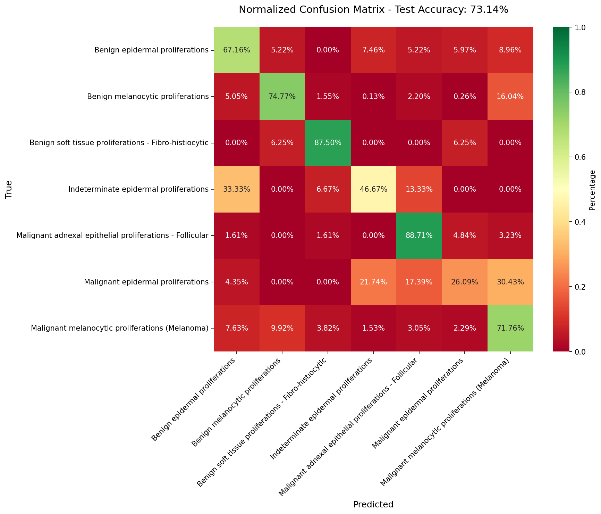
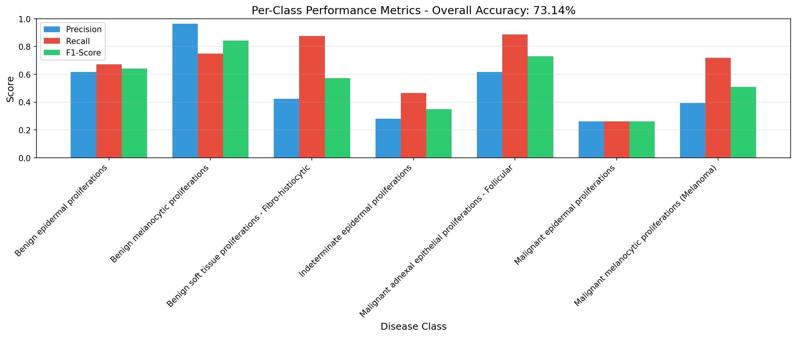
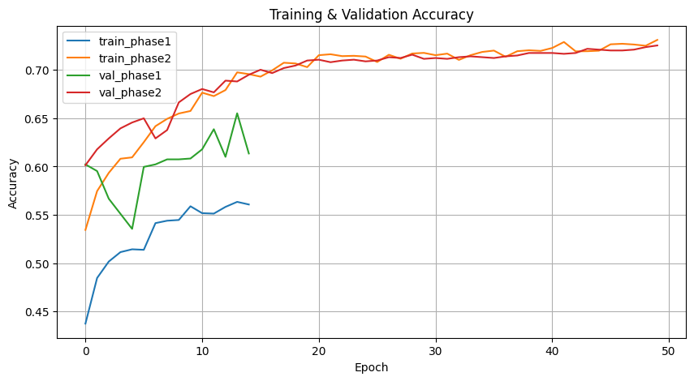

# 🧬 Skin Disease Detector using Deep Learning (ISIC Dataset)

A deep learning–based **Skin Disease Classification** project that automatically classifies dermoscopic images of skin lesions into seven diagnostic categories using **transfer learning** on **EfficientNetB4** with TensorFlow and Keras.

---

## 🌟 Project Overview

Skin cancer and other dermatological disorders are among the most common medical conditions worldwide. Early and accurate diagnosis plays a crucial role in improving patient outcomes.  
This project uses a **CNN-based image classification** approach to assist in identifying different types of skin lesions from the **ISIC (International Skin Imaging Collaboration)** dataset.

The trained model achieves over **73% test accuracy** (on a small subset of ~11,700 images) and can be further improved with larger datasets and fine-tuning.

---

## 📂 Dataset

- **Source:** [ISIC Archive Dataset](https://www.isic-archive.com/)
- **Subset used:** 11,720 dermoscopic images with associated metadata (`metadata.csv`)
- **Split:**
  - `train/` → ~9,200 images  
  - `val/` → ~1,150 images  
  - `test/` → ~1,150 images
- **Classes (7 categories):**
  1. Benign epidermal proliferations  
  2. Benign melanocytic proliferations  
  3. Benign soft tissue proliferations (Fibro-histiocytic)  
  4. Indeterminate epidermal proliferations  
  5. Malignant adnexal epithelial proliferations (Follicular)  
  6. Malignant epidermal proliferations  
  7. Malignant melanocytic proliferations (Melanoma)

---

## ⚙️ Techniques & Methodology

### 🧠 Model Architecture
- **Base model:** `EfficientNetB4` (pretrained on ImageNet)
- **Input size:** 380 × 380 × 3
- **Top layers:**
  - Global Average Pooling
  - Dropout (0.4)
  - Dense layer (ReLU)
  - Output Softmax (7 classes)

### 🧩 Data Processing
- Images preprocessed and validated using TensorFlow `image_dataset_from_directory`
- Grayscale images converted to RGB
- Normalized pixel intensities `[0, 1]`
- Data augmentation: rotation, zoom, flips, brightness shift

### 🏋️ Training Details
- **Optimizer:** Adam (`lr=1e-4`)
- **Loss:** Categorical Crossentropy (weighted)
- **Metrics:** Accuracy, Precision, Recall
- **Epochs:** 30
- **EarlyStopping & ModelCheckpoint** used for best model retention
- **Class weighting** applied to handle class imbalance

---

## 📊 Results

### ✅ **Test Accuracy:** `73.14%`

#### Confusion Matrix (Normalized)


#### Per-Class Performance


#### Training Plot


#### Classification Report
Accuracy: 73.14%
Weighted Precision: 81.05%
Weighted F1-score: 75.35%


---

## 🧰 Tech Stack

| Category | Tools / Frameworks |
|-----------|--------------------|
| Language | Python 3.10 |
| Deep Learning | TensorFlow, Keras |
| Data Handling | NumPy, Pandas |
| Visualization | Matplotlib, Seaborn |
| Environment | Virtualenv |
| Dataset | ISIC (Skin Lesion Dataset) |

---

## 🧪 Repository Structure

skin-disease-detector/
│
├── data_raw_small/ # Raw ISIC dataset subset
├── data_splits/ # Train, val, test image folders
│
├── prepare_dataset.py # Split, clean and preprocess data
├── train_model.py # Model building and training
├── evaluate_model.py # Model evaluation and visualization
├── analyze_labels.py # Label analysis and stats
├── inspect_metadata.py # Metadata exploration
│
├── confusion_matrix_normalized.png
├── per_class_performance.png
├── training_plot_research.png
├── classification_report.txt
│
├── requirements.txt
├── .gitignore
└── README.md


---

## 🚀 How to Run

1️⃣ **Clone the repo**
```bash
git clone https://github.com/Twilight-13/Skin-Disease-Detector.git
cd Skin-Disease-Detector


2️⃣ Create virtual environment

python -m venv .venv
source .venv/bin/activate   # On Windows: .venv\Scripts\activate


3️⃣ Install dependencies

pip install -r requirements.txt


4️⃣ Train the model

python train_model.py


5️⃣ Evaluate the model

python evaluate_model.py

💡 Key Learnings

Implemented transfer learning for medical image classification.

Tackled imbalanced data using class weights.

Visualized model interpretability with confusion matrices.

Created a modular ML pipeline: data prep → training → evaluation.

🔮 Future Scope

Train on the full ISIC dataset (62GB+) for better generalization.

Improve accuracy using fine-tuning and data augmentation.

Build an interactive web application (Streamlit / FastAPI + TensorFlow Lite).

Deploy on the cloud (Google Cloud / AWS / Hugging Face Spaces).


🧑‍💻 Author

Arijit Singha Roy
🔗[ GitHub](https://github.com/Twilight-13)

💼 www.linkedin.com/in/arijit-singha-roy-67ba05297


📜 License

This project is open-source under the MIT License.
Please check the licenses/ folder for ISIC dataset attribution and usage terms.
Accuracy: 73.14%
Weighted Precision: 81.05%
Weighted F1-score: 75.35%
